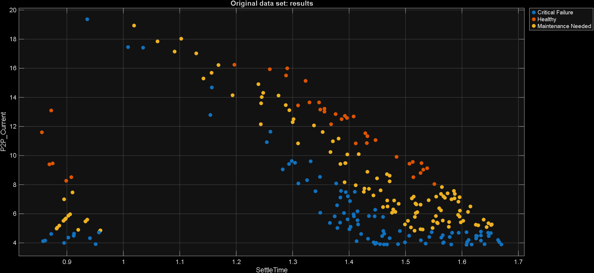
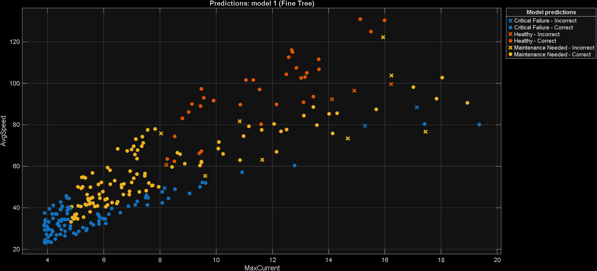

# Simscape-DC-Motor-Fault-Prediction

Simulating bearing wear and winding faults in a DC Motor to build a machine learning-based predictive maintenance tool.

## 📌 Overview
This repository contains a **Multi-Domain Digital Twin** of an Industrial DC Motor. Built using MATLAB and the Simscape Foundational Library, this project utilizes physics-based simulation to generate synthetic, noisy sensor data representing various states of mechanical and electrical degradation. 

This data is then used to engineer condition-monitoring features and train a Machine Learning classifier to predict equipment failure before it happens, demonstrating a complete end-to-end Predictive Maintenance (PdM) workflow.

## ⚙️ Project Architecture & Workflow

1. **Physical Modeling (The Twin):** Developed a high-fidelity first-principles model utilizing electrical (Resistance/Inductance) and mechanical (Inertia/Friction) domains.
2. **Automated Fault Injection:** Digitally aged the equipment by programmatically varying the internal friction coefficient ($B$) for bearing wear, and winding resistance ($R$) for insulation breakdown.
3. **Synthetic Data Generation:** Executed 100+ automated simulation runs, injecting Additive White Gaussian Noise (AWGN) to simulate real-world industrial sensor interference.
4. **Feature Engineering:** Extracted critical statistical health indicators from the raw signals, including **RMS Current**, **Kurtosis of Speed**, **Peak-to-Peak Current**, and **Settling Time**.

*Max Current vs Avg Speed*

*Settling Time vs Peak to Peak Current*
6. **AI Classification:** Trained a Support Vector Machine (SVM) to categorize the motor's health into three distinct states: *Healthy*, *Maintenance Needed*, and *Critical Failure*.

*Scatter plot of predictions*

## 📊 Results

## Key Performance Metrics
**Overall Accuracy:** The Support Vector Machine (SVM) classifier achieved **>90% accuracy** on unseen synthetic test data.
**Physics Insight:** The feature extraction phase revealed that Steady-State Speed alone is insufficient for diagnosis, as a drop in speed could be caused by either mechanical friction or a drop in supply voltage.
**Data Strategy:** By fusing the mechanical performance (Speed) with the electrical effort (RMS Current) and analyzing dynamic behavior (Kurtosis), the model successfully decoupled mechanical faults from electrical faults.
